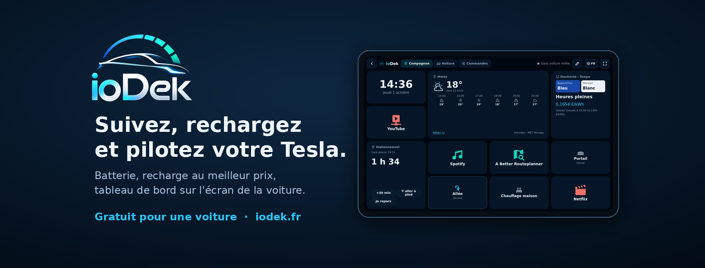

# ioDek

**ioDek** est une application web française pour suivre, recharger et piloter votre Tesla : santé réelle de la batterie, recharge aux heures les moins chères (heures creuses, Tempo, solaire), tableau de bord sur l'écran de la voiture, alertes, Sentinelle automatique et intégration Home Assistant.

👉 **https://iodek.fr** · gratuit pour une voiture, sans limite de durée.

Ce dépôt est l'espace **communautaire** d'ioDek. Le code de l'application n'y est pas, mais vous y trouverez :

| Dossier / lien | Contenu |
|---|---|
| [`themes/`](themes/) | Thèmes de couleurs du tableau de bord (fichiers CSS à importer dans ioDek), et comment proposer le vôtre |
| [Intégration Home Assistant](https://github.com/AllynFr/vigie-ha) | Votre Tesla dans Home Assistant, et vos boutons Home Assistant sur l'écran de la voiture (HACS) |
| [Documentation de l'API](https://iodek.fr/docs/api) | API publique d'ioDek (clés API, OpenAPI) |
| [Aide en ligne](https://iodek.fr/aide/tableau-de-bord) | Composer son tableau de bord, relier Home Assistant |
| [Issues](../../issues) | Idées, suggestions et bugs |

### Contribuer
- **Une idée ou un bug ?** Ouvrez une [issue](../../issues/new/choose). Vous pouvez aussi passer par le bouton « Avis » dans l'application.
- **Un thème ?** Voir [`themes/README.md`](themes/README.md) : ajoutez votre fichier `.css` et proposez une pull request.

---

## English

**ioDek** is a French web app to track, charge and control your Tesla: real battery health, cheapest-hour charging (off-peak, Tempo, solar), an in-car dashboard, alerts, automatic Sentry and Home Assistant integration. → **https://iodek.fr** (free for one car).

This repository is ioDek's **community space** (the app's source code is not here): dashboard colour **themes**, links to the **Home Assistant integration** and the **API docs**, and **issues** for ideas and bug reports. To share a theme, add your `.css` file under `themes/` and open a pull request.

---

ioDek est édité par ALLYN SAS. Application indépendante, non affiliée à Tesla, Inc.
