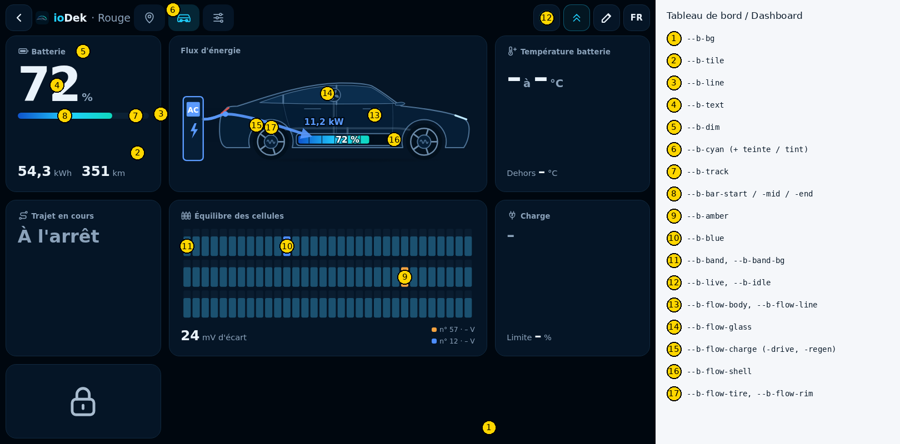
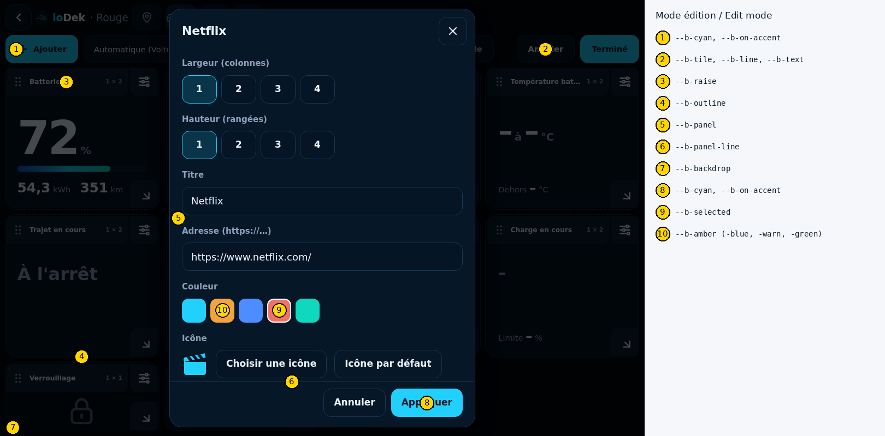

# Thèmes ioDek

*[English version](README.en.md)*

Thèmes de couleurs pour le tableau de bord d'[ioDek](https://iodek.fr) (`iodek.fr/bord`), l'écran plein écran fait pour le navigateur de la Tesla. Un thème change les couleurs, le rayon des cartes et l'espacement ; il ne change ni la disposition, ni les textes.

- `themes/` : les thèmes prédéfinis d'ioDek (ioDek, Nuit bleue, Graphite, Tesla clair, Contraste élevé) ;
- `exemple.css` : un thème commenté, pour commencer ;
- `scripts/check-theme.php` : vérifie un fichier avec les règles exactes du serveur ioDek ;
- `images/` : où se trouve chaque variable à l'écran.

## Format

Un thème est un fichier `.css` qui ne contient **que** des déclarations de variables `--b-…`, dans un bloc `.bord { … }` (ou `:root { … }`), et des commentaires. Le premier commentaire `ioDek theme: …` donne le nom du thème (40 caractères au plus).

```css
/* ioDek theme: Mon thème */
.bord {
    --b-bg: #10131a;
    --b-tile: #1a1f2b;
    --b-text: #f1f4fa;
    --b-cyan: #7cc4ff;
    --b-warn: hsl(4, 85%, 66%);
    --b-radius: 12px;
}
```

Les variables absentes gardent la valeur du thème ioDek. Taille maximale : 16 Ko.

### Valeurs acceptées

| Type | Valeurs |
| --- | --- |
| Couleur | `#rgb`, `#rgba`, `#rrggbb`, `#rrggbbaa` ; `rgb()`, `rgba()`, `hsl()`, `hsla()` (virgules ou espaces, transparence avec `/`) ; `transparent`, `black`, `white` |
| Longueur | `px` ou `rem` (1 rem = 16 px), bornée : `--b-radius` de 0 à 32 px, `--b-gap` de 4 à 32 px |

### Ce qui est refusé

Le CSS libre permettrait de faire fuir des données ou d'imiter l'interface. Le serveur lit donc le fichier et n'en garde que les valeurs autorisées ; **tout le reste refuse le fichier**, avec la ligne en cause :

- `@import`, `@media`, `@font-face` et toute règle `@` ;
- tout sélecteur autre que `.bord` et `:root` (`body`, `*`, `.b-tile`…) ;
- toute propriété qui n'est pas une variable connue (`color`, `position`, `content`, `display`…) ;
- une variable inconnue (`--b-foo`, `--autre`) ;
- `url()`, `expression()`, `var()`, `calc()`, `image-set()` et toute autre fonction que `rgb()`, `rgba()`, `hsl()`, `hsla()` ;
- `!important`, les chaînes entre guillemets, les échappements `\`, les blocs imbriqués ;
- une couleur ou une longueur hors des formes ci-dessus, ou hors des bornes.

Le thème accepté est enregistré en valeurs (JSON), jamais en CSS, et appliqué en variables dans un style en ligne : aucun fichier CSS n'est servi tel quel.

## Variables

Les valeurs indiquées sont celles du thème ioDek.





### Surfaces et textes

| Variable | ioDek | Rôle |
| --- | --- | --- |
| `--b-bg` | `#00070f` | Fond de l'écran |
| `--b-tile` | `#051526` | Fond des cartes, des onglets et des boutons de la barre |
| `--b-line` | `#11293f` | Bordure des cartes et des boutons |
| `--b-text` | `#eaf3fb` | Texte principal, chiffres |
| `--b-dim` | `#8ba2ba` | Texte secondaire : libellés, unités, état des données |
| `--b-muted` | `#9fb6cc` | Texte atténué : Boost inclus, note de l'aperçu écran Tesla |

### Couleurs d'accent

| Variable | ioDek | Rôle |
| --- | --- | --- |
| `--b-cyan` | `#21d0fd` | Accent principal : onglet actif (en teinte), état actif, boutons principaux, interrupteurs |
| `--b-amber` | `#f4a340` | Charge, puissance fournie, cellule la plus haute, attention |
| `--b-blue` | `#4d8dff` | Voiture endormie, cellule la plus basse |
| `--b-warn` | `#f07167` | Alerte, erreur, connexion perdue |
| `--b-green` | `#0ed8bd` | Vert des seuils et des liens |
| `--b-on-accent` | `#001526` | Texte posé sur l'accent (bouton principal) |

Les fonds teintés (onglet actif, pastilles, bandeaux) sont calculés à partir de l'accent correspondant.

### Pastille d'état des données

| Variable | ioDek | Rôle |
| --- | --- | --- |
| `--b-live` | `#2fd27a` | Données à l'instant |
| `--b-idle` | `#6b7f93` | Voiture endormie, en attente |

### Jauges et barres

| Variable | ioDek | Rôle |
| --- | --- | --- |
| `--b-track` | `#0b2135` | Piste des jauges, des barres et des interrupteurs |
| `--b-bar-start` | `#0f54cc` | Barre de batterie (et batterie du flux d'énergie) : début du dégradé |
| `--b-bar-mid` | `#21d0fd` | Milieu du dégradé |
| `--b-bar-end` | `#0ed8bd` | Fin du dégradé |
| `--b-band-bg` | `#0a1d30` | Équilibre des cellules : fond des bandes |
| `--b-band` | `#1b5170` | Équilibre des cellules : bande ordinaire |

### Commandes

| Variable | ioDek | Rôle |
| --- | --- | --- |
| `--b-button` | `#081b2d` | Fond des boutons de commande |
| `--b-press` | `#0c2236` | Bouton enfoncé |
| `--b-icon` | `#a9bccf` | Icône au repos (commandes, Home Assistant, catalogue) |
| `--b-field` | `#06121f` | Liste déroulante du choix de la voiture |
| `--b-peek` | `rgba(4, 14, 24, .92)` | Bandeau d'état sur un bouton en icône seule |

### Mode édition, panneaux, aperçu

| Variable | ioDek | Rôle |
| --- | --- | --- |
| `--b-raise` | `#0b1f33` | Poignées des cartes, message bref |
| `--b-outline` | `#1d3a57` | Contour pointillé des cartes en mode édition, bord des voyants |
| `--b-panel` | `#061727` | Fond des panneaux (réglages, catalogue, thème) |
| `--b-panel-line` | `#1a3653` | Bordures dans les panneaux |
| `--b-seg-on` | `#11304b` | Rubrique choisie dans un panneau |
| `--b-hover` | `#2c5a85` | Survol dans le choix d'icône |
| `--b-selected` | `#ffffff` | Contour de la couleur choisie |
| `--b-shadow` | `rgba(0, 0, 0, .6)` | Ombres (message bref, glisser) |
| `--b-backdrop` | `rgba(0, 0, 0, .7)` | Voile derrière les panneaux, ombre des panneaux |
| `--b-overlay` | `rgba(0, 6, 14, .92)` | Voile de l'aperçu écran Tesla |
| `--b-frame` | `#2a3b4f` | Cadre de l'aperçu écran Tesla |

### Flux d'énergie

| Variable | ioDek | Rôle |
| --- | --- | --- |
| `--b-flow-drive` | `#21d0fd` | Flux en roulant |
| `--b-flow-regen` | `#0ed8bd` | Récupération |
| `--b-flow-charge` | `#5b9bff` | Charge, borne |
| `--b-flow-heat` | `#f4a340` | Chauffage de la batterie |
| `--b-flow-body` | `#061e36` | Carrosserie |
| `--b-flow-line` | `#4d7194` | Traits de la voiture |
| `--b-flow-glass` | `#0b2d4d` | Vitres, rétroviseurs |
| `--b-flow-shell` | `#000e1c` | Boîtier de la batterie, halo des chiffres |
| `--b-flow-tire` | `#02101d` | Pneus |
| `--b-flow-rim` | `#6b8aa8` | Jantes |
| `--b-flow-track` | `rgba(107, 138, 168, .3)` | Trajet du flux au repos |
| `--b-flow-text` | `#e7f1f9` | Texte du flux |

### Formes

| Variable | ioDek | Rôle |
| --- | --- | --- |
| `--b-radius` | adaptatif (14 à 24 px) | Rayon des cartes, 0 à 32 px |
| `--b-gap` | adaptatif (8 à 18 px) | Espacement entre les cartes, 4 à 32 px |

Restent fixes, quel que soit le thème : les couleurs Tempo d'EDF (bleu, blanc, rouge), le logo, la carte (OpenStreetMap) et les phares du dessin de la voiture.

## Importer un thème

1. Sur `iodek.fr/bord`, appuyez sur le crayon **Modifier la disposition**.
2. Appuyez sur **Thème**, puis **Importer un fichier CSS** : choisissez le fichier `.css`, ou collez son contenu et appuyez sur **Importer**.
3. Le tableau de bord change tout de suite. Appuyez sur **Fermer**, puis sur **Terminé** pour l'enregistrer.

Le thème est enregistré avec la disposition du profil d'écran (Voiture ou Téléphone ou ordinateur). Dans le navigateur de la Tesla, le choix d'un fichier n'est pas toujours possible : collez le contenu, ou importez le thème depuis un ordinateur avec le profil **Voiture**.

**Exporter mon thème en CSS**, dans le même panneau, télécharge le thème en cours au même format : c'est le point de départ d'un nouveau thème.

## Vérifier un fichier

Avec PHP 8.1 ou plus récent, depuis le dossier `themes/` du dépôt :

```sh
php scripts/check-theme.php themes/mon-theme.css
```

Le script applique les règles du serveur ioDek (même code, `scripts/ThemeParser.php`, et même liste, `scripts/themes.json`). Il affiche chaque problème avec sa ligne et sort en erreur si un fichier est refusé. Le même contrôle tourne sur chaque pull request (`.github/workflows/check-themes.yml`).

## Proposer un thème

1. Forkez ce dépôt et créez une branche.
2. Ajoutez votre fichier dans `themes/`, nommé en minuscules avec des tirets (`themes/sable-du-desert.css`), avec le commentaire `/* ioDek theme: Nom */` en tête.
3. Vérifiez-le : `php scripts/check-theme.php themes/sable-du-desert.css`.
4. Ouvrez une pull request avec une capture du tableau de bord (écran de la Tesla ou fenêtre de 1180 × 800) et, si possible, une capture en plein soleil pour un thème clair.

Un bon thème garde un texte lisible (contraste d'au moins 4,5:1 entre `--b-text` et `--b-tile`), distingue l'accent de l'alerte et reste confortable la nuit dans la voiture.
